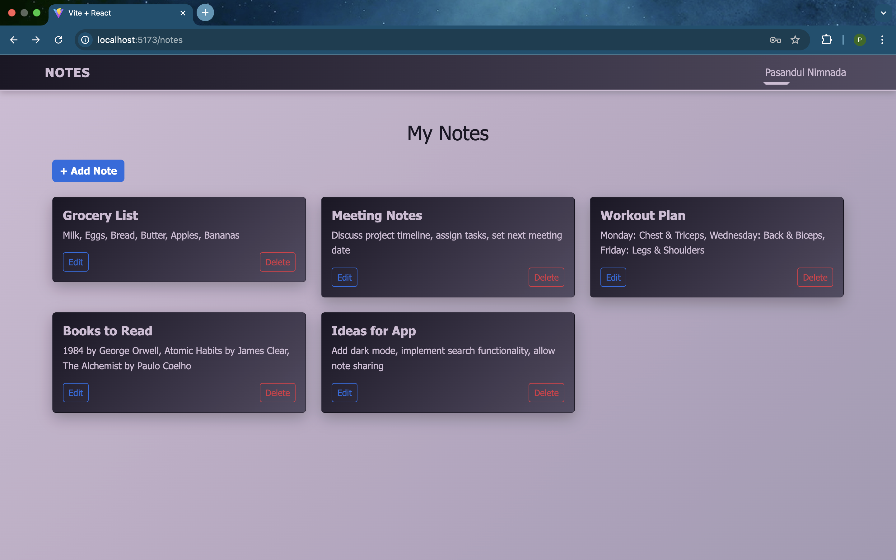

# Notes App

A full-stack **Notes Application** built with **MERN stack** (MongoDB, Express, React, Node.js) featuring user authentication, note creation, and management. This project demonstrates a modular architecture with separate backend and frontend folders, ready for development and deployment.

---

## Live Demo
[View Live Demo](https://your-live-demo-link.com)  



---

## Features

- User authentication using **JWT**.
- Create, read, update, and delete notes.
- Organized folder structure with **backend** and **frontend**.
- Responsive design using **Bootstrap**.
- State management with **Redux Toolkit**.
- Toast notifications with **React-Toastify**.

---

## Tech Stack

### Backend

- Node.js
- Express
- MongoDB + Mongoose
- JWT for authentication
- Bcrypt for password hashing
- Cookie-parser & CORS

### Frontend

- React
- Redux Toolkit
- React Router
- Bootstrap & React-Bootstrap
- React-Toastify

### Root

- Concurrently to run backend & frontend together

---

## Installation

### Prerequisites

- Node.js >= 18
- npm >= 9
- MongoDB Atlas or local MongoDB

1. Clone the repository

```bash
git clone https://github.com/IsuruGimhana/Notes-App.git
```
2. Navigate into the project directory

```bash
cd Notes-App
```
3. Install backend dependencies

```bash
cd backend
npm install
```
4. Install frontend dependencies

```bash
cd ../frontend
npm install
```
5. Go back to root

```bash
cd ..
```

---

## Environment Variables

```bash
MONGO_URI=<your_mongodb_connection_string>
JWT_SECRET=<your_jwt_secret>
PORT=8000
```

## Running the App
```bash
npm run dev
```
This will start both the backend server and the React frontend concurrently.

Backend: http://localhost:8000

Frontend: http://localhost:5173 (Vite default port)

## Project Structure
```text
root/
├── backend/ # Node.js + Express backend
│ ├── server.js
│ ├── routes/
│ ├── controllers/
│ └── models/
├── frontend/ # React frontend
│ ├── src/
│ ├── public/
│ └── vite.config.js
├── package.json # Root package.json for concurrently
└── README.md

